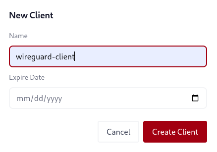
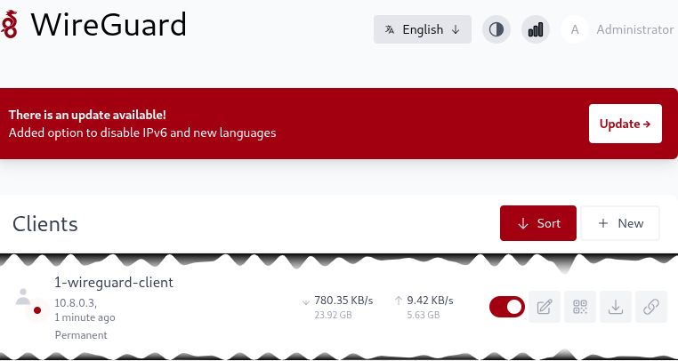
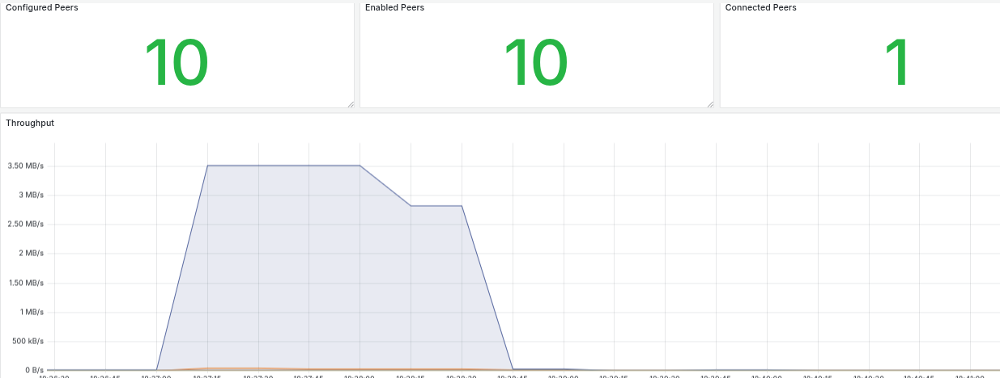

# VPN Wireguard avec wg-easy

Wireguard est un protocole VPN rapide, moderne et sécurisé. Pour simplifier son déploiement, nous utilisons **wg-easy**, une solution clé en main qui fournit une interface web d’administration et qui se déploie facilement via docker.

*Note : Il est aussi possible d’installer Wireguard directement sur un pare-feu pfSense ou OPNsense.*

---


## Installation de Docker

Pour commencer, installez Docker avec la commande officielle :

```
curl -sSL https://get.docker.com | sh
```

---

## Déploiement de wg-easy avec Docker Compose

1. Créez le dossier de configuration :

```
sudo mkdir -p /etc/docker/containers/wg-easy
```

2. Téléchargez le fichier Docker Compose officiel de wg-easy :

```
sudo curl -o /etc/docker/containers/wg-easy/docker-compose.yml \
  https://raw.githubusercontent.com/wg-easy/wg-easy/master/docker-compose.yml
```

3. Démarrez le service wg-easy :

```
cd /etc/docker/containers/wg-easy
sudo docker compose up -d
```

---

## Configuration de wg-easy

- Accédez à l’interface web de wg-easy sur le port TCP configuré (par défaut `51821`).
- Renseignez dans l'interface :
  - L’adresse IP publique de votre serveur.
  - Le port UDP utilisé par Wireguard (souvent `51820`).
- Spécifiez l’interface d’écoute réseau de votre hôte (exemple : `eth1`).
- Dans la section **hooks NAT**, indiquez le nom de l’interface Docker Wireguard (souvent `wg0`).



---

## Gestion des clients Wireguard

- Créez un client Wireguard directement depuis l’interface web.



- Chaque client génère automatiquement une clé et un QR code pour une installation rapide sur les appareils mobiles.
- Vous pouvez activer ou désactiver un client à tout moment.
---

## Supervision et métriques

- Surveillez le trafic Wireguard depuis l’interface de wg-easy.
- Il est possible d’exporter les métriques prometheus fournies par wg-easy vers un tableau grafana pour un suivi.



---

## Notes supplémentaires

- Assurez-vous que le port UDP choisi (par défaut `51820`) est bien ouvert sur votre firewall.
- En environnement virtualisé ou cloud, configurez correctement les règles NAT.
- Pour un usage en production, sécurisez l’interface web, par exemple avec un reverse proxy et authentification.
- Vous pouvez modifier le fichier `docker-compose.yml` pour adapter les ports ou d’autres paramètres.


